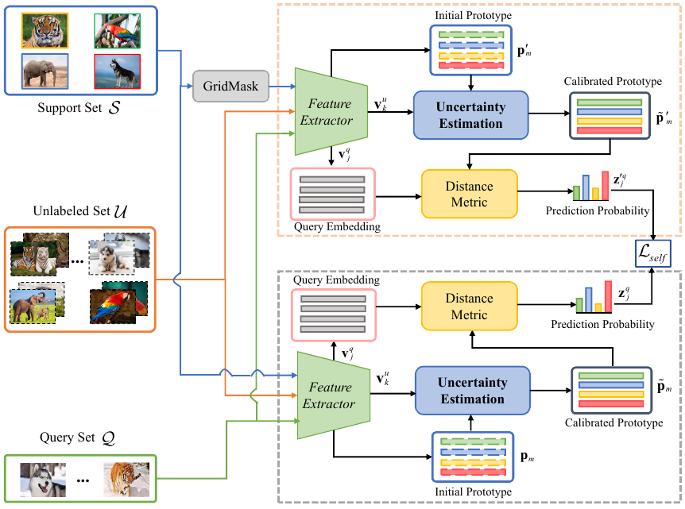
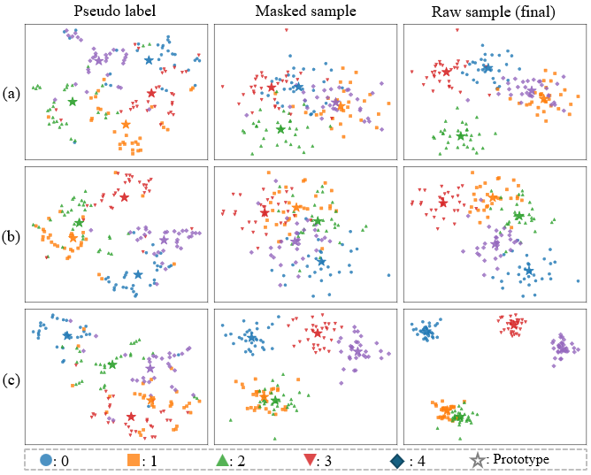

# **U**ncertainty **E**stimation with **S**elf-**D**istillation for Semi-Supervised Few-shot Classification

## Introduction

Semi-supervised few-shot classification aims to recognize unseen samples within the same classes in the support set by only a few labeled samples and rich unlabeled samples. A heuristic solution is to generate pseudo labels for those unlabeled samples, however, previous methods fail to generate high-quality pseudo labels and class prototype representations. To handle the drawbacks, this paper proposes the **U**ncertainty **E**stimation with **S**elf-**D**istillation (UESD) approach for semi-supervised few-shot classification. It adopts an uncertainty estimation criterion to compute the confidence scores of pseudo-labels based on the probability entropy of neighbouring samples. This reduces the influences of those pseudo-labeled samples with lower confidence. Simultaneously, it introduces a masked self-distillation strategy to train a better model, by adding mask occlusions to a few labeled samples in the support set. This encourages the model to learn better class prototype representations under the guidance of self-distillation knowledge. Experimental results on three benchmarks including mini-ImageNet, tiered-ImageNet, and CUB-200-2011 demonstrate the superiority of the proposed method. [Paper](https://www.sciencedirect.com/science/article/abs/pii/S0950705125009931)

 

## Install requirements

Install [Conda](https://docs.conda.io/en/latest/miniconda.html) and then create an environment as follows:

- python = 3.8.19

```
conda create -n uesd python=3.8.19
```

Install dependency packages

```
pip install -r requirements.txt
```

### Download the Datasets

* [mini-imagenet](https://github.com/renmengye/few-shot-ssl-public#miniimagenet)

```
USED/
└── miniImageNet/
  │   ├── train.csv  
  |	  ├── test.csv  
  |	  ├── val.csv  
  │   ├── images/
  │   │   └── n01930112
  |	  |   		└── .png(image files)
```

Create a 'data' folder.
Untar the downloaded file and move it into the 'data' folder.

### Training&Test


#### 1. Pre-training
```
python trainit.py <path-to-json-file> -sb <save-dir> -t <save-title>
```
where `<path-to-json-file>` is the directory where the parameter config file of pre-training is saved. `<save-dir>` is the directory where the all ckpts of pre-training are saved. `<save-title>` is the directory where the current ckpt of pre-training is saved.

e.g.

```
 python trainit.py cfgs/pretrain_miniimagenet_wrn.json -sb logs/pretrain -t pretrain_miniimagenet_wrn
```


#### 2. Fine-tuning
```
python trainit.py <path-to-json-file> <ckpt-path> -sb <save-dir> -t <save-title>
```
where `<path-to-json-file>` is the directory where the parameter config file of fine-tuning is saved. `<ckpt-path>` is the directory of related pretrain-ckpt-file.

e.g.

```
python trainit.py cfgs/finetune_miniimagenet_wrn_1.json --ckpt logs/pretrain/pretrain_miniimagenet_wrn/checkpoint_best.pth -sb logs/finetune -t miniimagenet_wrn_1
```

#### 3. UESD experirments with unlabeled Set
```
python testit.py <path-to-json-file> <ckpt-path>-sb <save-dir> -s <operation: ssl | kmeans | MFC> -t <save-title>
```
where `<path-to-json-file>` is the directory where the parameter config file of UESD-testing is saved. `<ckpt-path>` is the directory of related finetune-ckpt-file.

e.g.

```
python testit.py cfgs/ssl_large_miniimagenet-wrn-1.json logs/finetune/miniimagenet_wrn_1/checkpoint_best.pth -sb logs/UESD -s MFC -t UESD_miniimagenet_wrn_1
```

### Quantitative results on mini-ImageNet

| Backbone  | 5-way 1-shot | 5-way 5-shot |
| --------- | ------------ | ------------ |
| WRN-28-10 | 83.71±0.56   | 89.75±0.64   |
| ResNet-12 | 78.67±0.79   | 86.64±0.58   |

### Qualitative results



(a) is the result of mini-ImageNet dataset; (b) is the result of tiered-ImageNet dataset; (c) is the result of CUB-200-2011 dataset.

## Citation

```
@article{li-kbs2025-uesd_semifewshot,
  author    = {Jiajun Chen, Ping Li, Renshu Gu},
  title     = {Uncertainty estimation with self-distillation for semi-supervised few-shot classification},
  journal   = {Knowledge-Based Systems (KBS)},
  volume    = {325},
  pages     = {113948},
  year      = {2025},
  doi       = {https://doi.org/10.1016/j.knosys.2025.113948}
}
```

## Contact

If you have any questions, please feel free to contact Mr. Jiajun Chen via email ( [241050087@hdu.edu.cn](mailto:241050087@hdu.edu.cn)).

## Acknowledgment

We thank the following repositories providing helpful components/functions in our work:

- [cluster-FSL](https://gitlab.com/smartllvlab/cluster-fsl)
- [Embedding Propagation](https://github.com/ElementAI/embedding-propagation)
